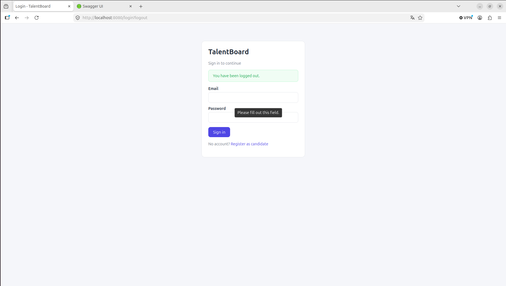
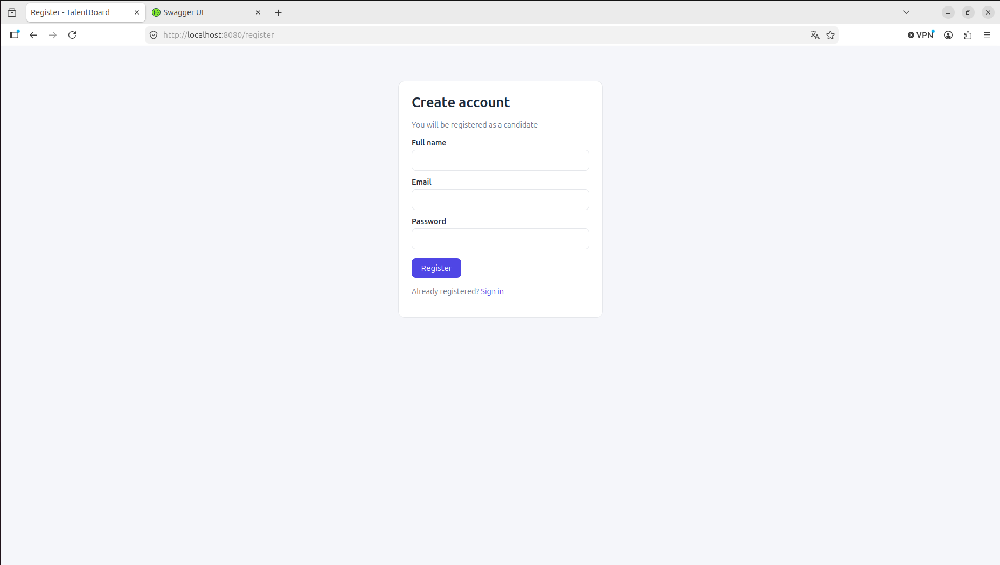
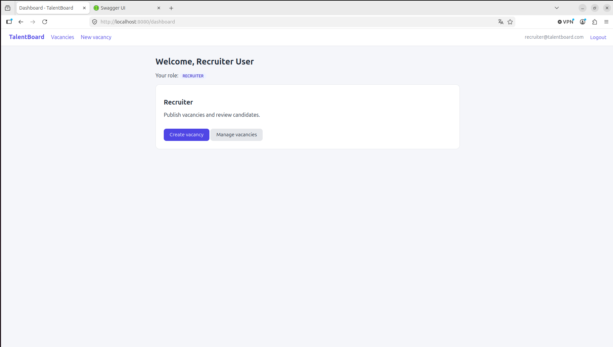

# TalentBoard

Recruitment process management system. TalentBoard centralizes vacancies,
candidates, applications and interviews in a single platform, covering the full
selection cycle from publishing a vacancy to the final hiring decision.

> Built with Spring Boot for the Module 6 performance test.

## Tech stack

- **Java 17** + **Spring Boot 3.3**
- **Spring Web** + **Thymeleaf** (server-side rendered UI)
- **Spring Data JPA** / **Hibernate** (persistence)
- **Spring Security** (session-based authentication & role-based authorization)
- **Bean Validation** (request validation)
- **PostgreSQL** (relational database)
- **springdoc-openapi** (Swagger UI)
- **Docker** / **docker-compose**
- **Lombok**

## Architecture

Layered architecture with a clear separation of responsibilities:

```
web (Thymeleaf) ┐
                ├─> service ─> repository ─> database
controller (API)┘     │
                  business rules
   DTOs (request/response) + mappers + global error handling
```

- **entity**: JPA entities (database model).
- **enums**: roles and process states.
- **repository**: Spring Data JPA interfaces.
- **service**: business logic and business-rule enforcement.
- **dto**: request/response objects (entities are never exposed directly).
- **mapper**: entity <-> DTO conversion.
- **controller**: REST endpoints (JSON).
- **web**: Thymeleaf view controllers (HTML pages).
- **config**: security, current-user helper, data seeding, OpenAPI.
- **exception**: custom exceptions + centralized `@RestControllerAdvice`.

## Domain model

| Entity | Description |
|--------|-------------|
| `User` | System user with a single `Role` (ADMIN, RECRUITER, CANDIDATE). |
| `Vacancy` | Job opening owned by a recruiter, with a `VacancyStatus`. |
| `Application` | A candidate's application to a vacancy, with an `ApplicationStatus`. |
| `Interview` | An interview attached to an application. |

**Relationships:** a recruiter owns many vacancies; a vacancy has many
applications; a candidate has many applications; an application has many
interviews.

### Selection flow (ApplicationStatus)

```
APPLIED -> IN_REVIEW -> INTERVIEW -> OFFERED -> HIRED
                    \-> REJECTED / WITHDRAWN (terminal)
```

## Roles and permissions

| Action | ADMIN | RECRUITER | CANDIDATE |
|--------|:---:|:---:|:---:|
| Register (self) | - | - | yes |
| Create users with any role | yes | - | - |
| Create / edit vacancies | yes | yes | - |
| Change vacancy status | yes | yes | - |
| View vacancies | yes | yes | yes |
| Apply to a vacancy | - | - | yes |
| View own applications | - | - | yes |
| View applications of a vacancy | yes | yes | - |
| Change application status | yes | yes | - |
| Schedule / update interviews | yes | yes | - |

## Business rules

- A candidate cannot apply more than once to the same vacancy (enforced in the
  service **and** by a unique DB constraint on `(candidate_id, vacancy_id)`).
- Applications are only accepted for vacancies in `OPEN` status.
- Interviews cannot be scheduled before the current date.
- Users can only access information authorized for their role.
- Candidates can only see their own applications.

## Requirements

- Docker + Docker Compose, **or**
- Java 17 + Maven + a local PostgreSQL instance.

## Environment variables

Copy `.env.example` to `.env` and adjust if needed:

| Variable | Default | Description |
|----------|---------|-------------|
| `DB_NAME` | `talentboard` | Database name |
| `DB_USERNAME` | `talentboard` | Database user |
| `DB_PASSWORD` | `talentboard` | Database password |
| `DB_HOST` | `localhost` | Database host |
| `DB_PORT` | `5432` | Database port |
| `SERVER_PORT` | `8080` | App port |

## Run with Docker (recommended)

```bash
cp .env.example .env
docker compose up --build
```

App available at `http://localhost:8080`.

## Run locally (without Docker)

1. Start PostgreSQL and create the `talentboard` database.
2. Run:

```bash
mvn spring-boot:run
```

## Test credentials

Seeded automatically on first startup (only if the users table is empty):

| Role | Email | Password |
|------|-------|----------|
| ADMIN | `admin@talentboard.com` | `admin123` |
| RECRUITER | `recruiter@talentboard.com` | `recruiter123` |
| CANDIDATE | `candidate@talentboard.com` | `candidate123` |

## Web UI (Thymeleaf)

Open `http://localhost:8080`. You will be redirected to the login page.
After signing in you reach a role-aware dashboard:

- **Candidate**: browse vacancies, apply, track applications and see their
  scheduled interviews (agenda) under each application.
- **Recruiter / Admin**: create vacancies, then open an application detail
  (`/applications/{id}`) to advance the selection status, schedule interviews
  (agenda), list them and record their results.

## REST API

Interactive docs (Swagger UI): `http://localhost:8080/swagger-ui.html`
The API supports **HTTP Basic** auth, so you can test it directly in Swagger
(use the "Authorize" button) or in Postman with the seeded credentials.

### Main endpoints

| Method | Endpoint | Role | Description |
|--------|----------|------|-------------|
| POST | `/api/auth/register` | public | Register a candidate |
| GET/POST | `/api/users` | ADMIN | List / create users |
| GET | `/api/vacancies` | any | List all vacancies |
| GET | `/api/vacancies/open` | any | List open vacancies |
| GET | `/api/vacancies/{id}` | any | Vacancy detail |
| POST | `/api/vacancies` | RECRUITER/ADMIN | Create vacancy |
| PUT | `/api/vacancies/{id}` | RECRUITER/ADMIN | Update vacancy |
| PATCH | `/api/vacancies/{id}/status` | RECRUITER/ADMIN | Change status |
| POST | `/api/applications` | CANDIDATE | Apply to a vacancy |
| GET | `/api/applications/me` | CANDIDATE | My applications |
| GET | `/api/applications/{id}` | any* | Application detail (*own only for candidate) |
| GET | `/api/applications/vacancy/{id}` | RECRUITER/ADMIN | Applications of a vacancy |
| PATCH | `/api/applications/{id}/status` | RECRUITER/ADMIN | Update application status |
| POST | `/api/interviews` | RECRUITER/ADMIN | Schedule interview |
| GET | `/api/interviews/application/{id}` | any | Interviews of an application |
| PATCH | `/api/interviews/{id}/result` | RECRUITER/ADMIN | Record result |

### Quick example (curl)

```bash
# List open vacancies as the candidate
curl -u candidate@talentboard.com:candidate123 \
  http://localhost:8080/api/vacancies/open

# Apply to vacancy 1
curl -u candidate@talentboard.com:candidate123 \
  -H "Content-Type: application/json" \
  -d '{"vacancyId": 1}' \
  http://localhost:8080/api/applications
```

## Evidence

### Login


### Register


### Home


###